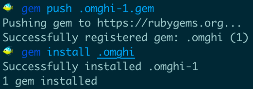
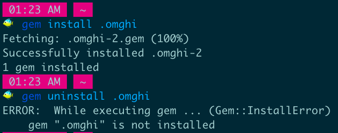

A hidden gem!
=============

You can install it, but it won't show up in the gem list,
and you can't require its files b/c Rubygems doesn't realize
it's installed.
It is there, though, you can see it with `gem contents .omghi`

Note that uninstalling it is... nontrivial 😅

